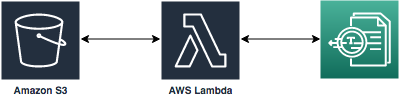

# Module 1 - Amazon Textract
In this module we'll be creating the text extraction portion of the document image processing and indexing pipeline.  The services that we'll be interacting with are Amazon S3, Amazon Textract, and AWS Lambda.  

When a document image is uploaded to S3, Lambda will receive an event trigger.  The Lambda function will process the event, retrieve the document from S3 and submit it to Textract for processing. Textract will respond with a JSON representation of the processed image. The Lambda function will process the JSON response and create a text file. Finally, the Lambda function will upload the text file to the same S3 bucket with `processed/` included in the object key prefix.

Follow the steps below to complete Module 1.

<strong>1. Create an S3 Bucket (click to expand)</strong>

1. Sign in to the [AWS Management Console](https://console.aws.amazon.com).

2. Navigate to S3 by searching `S3` in the center search bar and clicking on `S3` in the results.

3. From the Amazon S3 console dashboard, choose **Create Bucket**.

4. In Create a Bucket, type a bucket name in Bucket Name.

The bucket name you choose must be globally unique across all existing bucket names in Amazon S3 (that is, across all AWS customers). For more information, see [Bucket Restrictions and Limitations](https://docs.aws.amazon.com/AmazonS3/latest/dev/BucketRestrictions.html).

5. Choose **Create**.

When Amazon S3 successfully creates your bucket, the console displays your empty bucket in the Buckets pane.

<strong>2. Create a Lambda Function (click to expand)</strong>

1. Sign in to the [AWS Management Console](https://console.aws.amazon.com).

2. Navigate to Lambda by searching `Lambda` in the center search bar and clicking on `Lambda` in the results.

3. Click **Create Function**

4. Choose **Author From Scratch** and provide a function name that you can use to uniquely identify your function. Select **Python 3.6** as the runtime

5. Expand the section called **Choose or create an execution role**, select **Use existing role** and select **Textract-S3** as the role and click **Create Function**

6. In the Lambda function, select **S3** from the Add Trigger list on the top left of the page.

7. Scroll down to configure the trigger in the **Configure triggers** section by selecting your bucket name from the drop down. Then, select **All object create events** for Event type. Next, select `images/` as the prefix, and leave the Suffix section blank.

8. Ensure that there is a checkmark in the box next to enable trigger, and click **Add**

9. Scroll up and click on your Lambda function's name in the designer, and then scroll down to your function's code.

10. Unzip your local copy of [module_1.zip](module_1.zip).

11. Update `lambda_function.py` on line 6 to include your bucket name, and re-zip the archive libraries with your updated python script.

12. Choose the **Code entry type** `Upload a .zip file`.  Select your archive.zip file, and click **Upload**.

11. Click **Save**, at the top of the page.  

To Verify that you've completed this section, upload the sample document provided to your s3 bucket under the `images/` object key prefix. You should see a text file under the `processed/` object key prefix in a few seconds.
