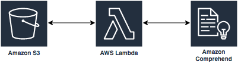

# Module 2 - Amazon Comprehend
In this module we'll be creating the entity extraction portion of the document image processing and indexing pipeline.  The services that we'll be interacting with are Amazon S3, Amazon Comprehend, and AWS Lambda.  

When a text document is uploaded to S3 under the `processed/` object key prefix, Lambda will receive an event trigger.  The Lambda function will process the event, retrieve the document from S3 and submit it to Comprehend for processing. Comprehend will respond with a JSON response that includes relevant entities from the processed document. The Lambda function will process the JSON response and create a text file. Finally, the Lambda function will upload the text file to the same S3 bucket with `/processed` included in the object key prefix.

Follow the steps below to complete Module 2.

<strong>1. Create a Lambda Function (click to expand)</strong>

1. Sign in to the [AWS Management Console](https://console.aws.amazon.com).

2. Navigate to Lambda by searching `Lambda` in the center search bar and clicking on `Lambda` in the results.

3. Click **Create Function**

4. Choose **Author From Scratch** and provide a function name that you can use to uniquely identify your function. Select **Python 3.6** as the runtime

5. Expand the section called **Choose or create an execution role**, select **Use existing role** and select **Comprehend-S3** as the role and click **Create Function**

6. In the Lambda function, select **S3** from the Add Trigger list on the top left of the page.

7. Scroll down to configure the trigger in the **Configure triggers** section by selecting your bucket name from the drop down. Then, select **All object create events** for Event type. Next, select `processed/` as the prefix, and leave the Suffix section blank.

8. Ensure that there is a checkmark in the box next to enable trigger, and click **Add**

9. Scroll up and click on your Lambda function's name in the designer, and then scroll down to your function's code.

10. Copy your code from the [comprehend-trigger.py](comprehend-trigger.py) function included here in the repo. Be sure to edit line 7 to include your S3 bucket name.

11. Update the timeout from 3 seconds to 1 minute under **Basic Settings**.

12. Click **Save**, at the top of the page.  

When you're done continue on to [Module 3: ElasticSearch Indexing](../Module_3/README.md)
