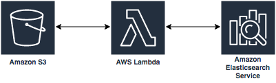

# Module 3 - ElasticSearch indexing

In this module we'll be creating the indexing portion of the document image processing and indexing pipeline.  The services that we'll be interacting with are Amazon S3, Amazon ElasticSearch, and AWS Lambda.  

When a JSON document is uploaded to S3 under the `json/` object key prefix, Lambda will receive an event trigger.  The Lambda function will process the event, retrieve the document from S3 and submit it to ElasticSearch for indexing. Elasticsearch will respond with an HTTP response that indicates the successful receipt of the payload. The ElasticSearch index will provide entity based search and return a document that you can retrieve from your index for further review.

Follow the steps below to complete Module 3.

<strong>1. Create an Amazon ElasticSearch Index (click to expand)</strong>

1. Navigate to CloudFormation by searching `CloudFormation` in the center search bar and clicking on `CloudFormation` in the results.

2. Click **Create Stack**

3. Under **Choose a template** select **Upload a template to S3**

4. Upload the [elasticsearch-cf.yaml](elasticsearch-cf.yaml) template included in this module.

5. Provide a unique stack name and click **Next**

6. Click **Next** at the bottom of the screen.

7. Review the information in the next page and then click **Create** (Note: Creation can take ~10 minutes)

8. Once the status of your stack is **CREATE_COMPLETE**, click on your **Stack Name** and expand the outputs to reveal your ElasticSearch URL.

9. Copy your ElasticSearch **Endpoint URL** into line 17 of [lambda_function.py](lambda_function.py). Be sure to edit line 18 to include your S3 bucket name.

<strong>2. Create a Lambda Function (click to expand)</strong>

1. Sign in to the [AWS Management Console](https://console.aws.amazon.com).

2. Navigate to Lambda by searching `Lambda` in the center search bar and clicking on `Lambda` in the results.

3. Click **Create Function**

4. Choose **Author From Scratch** and provide a function name that you can use to uniquely identify your function. Select **Python 3.6** as the runtime

5. Expand the section called **Choose or create an execution role**, select **Use existing role** and select **ElasticSearch-Demo** as the role and click **Create Function**

6. In the Lambda function, select **S3** from the Add Trigger list on the top left of the page.

7. Scroll down to configure the trigger in the **Configure triggers** section by selecting your bucket name from the drop down. Then, select **All object create events** for Event type. Next, select `json/` as the prefix, and leave the Suffix section blank.

8. Ensure that there is a checkmark in the box next to enable trigger, and click **Add**

9. Scroll up and click on your Lambda function's name in the designer, and then scroll down to your function's code.

10. Unzip your local copy of [module_3.zip](module_3.zip).

11. Update `lambda_function.py` on line 6 to include your bucket name, and re-zip the archive libraries with your updated python script.

12. Choose the **Code entry type** `Upload a .zip file`.  Select your archive.zip file, and click **Upload**.

13. Update the timeout from 3 seconds to 1 minute under **Basic Settings**.

14. Click **Save**, at the top of the page.  

<strong>2. Search your Index (click to expand)</strong>

1. Navigate to ElasticSearch by searching `ElasticSearch` in the center search bar and clicking on `ElasticSearch` in the results.

2. Click **Modify Access Policy**

3. Click **Select a template**, and select `allow access to a domain from an IP`.

4. Provide your public IP address in the modal, and click **OK**.

5. Click on your ElasticSearch Domain, and then click on the Kibana URL to navigate to your Kibana dashboard.

6. This will open up the Kibana dashboard. On the **Index pattern** text box, type `lambda-index` and choose **Create**.

7. You will see the field and attribute names in Kibana on which we will build some visualizations.

8. On the left navigation pane, click **Management** and then click **Saved Objects**.

9. Click Import on the top right corner and navigate to the Entity_Dashboard.json file within your Module_3 directory.

10. You will see a pop-up message with a question asking if you want to overwrite. Choose Yes, overwrite all.

11. You will see another pop-up window saying some index patterns do not exist. Make sure lambda-index is selected in the drop-down Newindex pattern list and click **Confirm all changes**. You should see a new dashboard called EntityDashboard.

12. On the left navigation pane, click **Dashboard** and then on the EntityDashboard Link. Search for a filename like `FileName"buckleyjohnsample.pdf"`, and you will see the dashboard with visualizations generated from the extracted entities.

