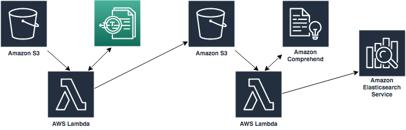

# Machine Learning Services Immersion Day

This repository includes hands-on labs that are intended to support a Machine Learning Immersion day provided by AWS Solutions Architects. By this end of this lab, you will have created a document processing platform that can take JPG images of documents and perform OCR, entity extraction, and indexing leveraging Amazon S3, AWS Lambda, Amazon Textract, Amazon Comprehend, and Amazon Elasticsearch.  A reference architecture is pictured below.

Complete the modules in order, as the earlier modules are prerequisites for the later ones. Click the link below to begin Module 1.

[Module 1](Module_1/README.md)
