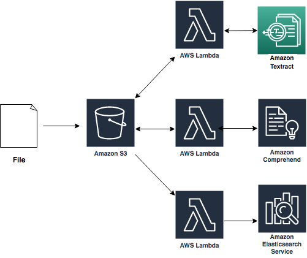

# Machine Learning Services Immersion Day

This repository includes hands-on labs that are intended to support a Machine Learning Immersion day provided by AWS Solutions Architects. By this end of this lab, you will have created a document processing platform that can take PDF files and perform OCR, entity extraction, and indexing leveraging Amazon S3, AWS Lambda, Amazon Textract, Amazon Comprehend, and Amazon Elasticsearch.  A reference architecture is pictured below.

Complete the modules in order, as the earlier modules are prerequisites for the later ones. Click the link below to begin Module 1.

[Module 1](Module_1/README.md)

---

## Prerequisites
### AWS Account

In order to complete this workshop you'll need an AWS Account with access to use Amazon Textract, S3, Lambda and Comprehend resources. If you are sharing an account with another student, you may into naming conflicts for certain resources. You can work around these by appending a unique suffix to the resources that fail to create due to conflicts, but the instructions do not provide details on the changes required to make this work.

All of the resources you will launch as part of this workshop are eligible for the AWS free tier if your account is less than 12 months old. See the AWS Free Tier page for more details.
### Browser

We recommend you use the latest version of Chrome to complete this workshop.
### Text Editor

You will need a local text editor for making minor updates to configuration files.
### Modules

This workshop is broken up into multiple modules. You must complete each module before proceeding to the next.

[Module 1: Textract OCR](Module_1/README.md)

[Module 2: Comprehend Analysis](Module_2/README.md)

[Module 3: ElasticSearch Indexing](Module_3/README.md)
